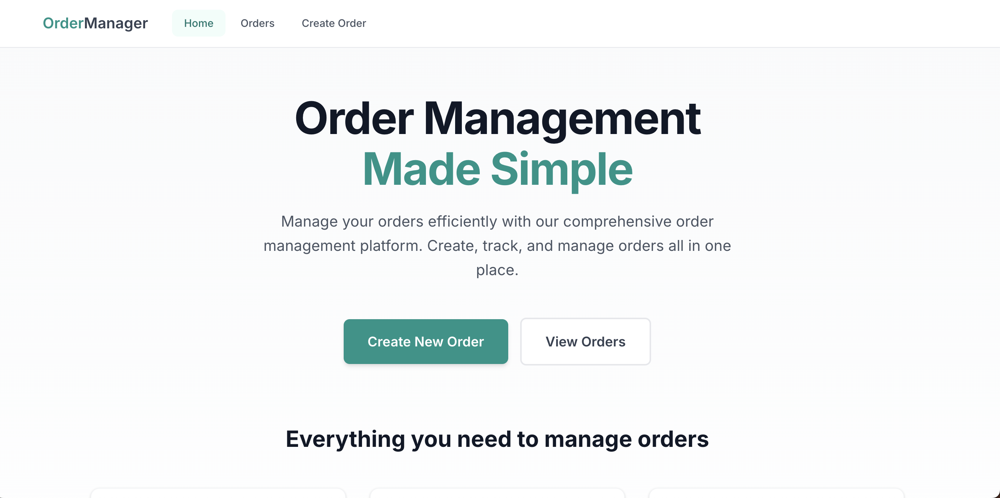

# OrderFlow Platform

> **End-to-End Order Management Platform with Complete DevOps Pipeline**



[](https://www.oracle.com/java/)
[](https://spring.io/projects/spring-boot)
[](https://reactjs.org/)
[](https://www.typescriptlang.org/)
[](https://www.docker.com/)
[](https://kubernetes.io/)
[](LICENSE)

A production-ready, full-stack order management microservice platform featuring Spring Boot backend, React frontend, and complete DevOps tooling including Docker, Kubernetes, CI/CD pipelines, and monitoring.

---

## 📋 Table of Contents

- [Overview](#overview)
- [Features](#features)
- [Architecture](#architecture)
- [Tech Stack](#tech-stack)
- [Quick Start](#quick-start)
- [Project Structure](#project-structure)
- [API Documentation](#api-documentation)
- [Deployment](#deployment)
- [DevOps Pipeline](#devops-pipeline)
- [Development](#development)
- [Contributing](#contributing)
- [License](#license)

---

## 🎯 Overview

**OrderFlow** is a comprehensive order management platform designed for modern e-commerce and business operations. It provides a complete solution from order creation to fulfillment, with enterprise-grade DevOps practices built-in.

### Key Highlights

- ✅ **Full-Stack Application**: Spring Boot REST API + React TypeScript Frontend
- ✅ **Production-Ready**: Docker, Kubernetes, Helm charts included
- ✅ **DevOps Complete**: CI/CD pipelines, monitoring, health checks
- ✅ **Modern Stack**: Java 17, Spring Boot 3.2, React 18, TypeScript
- ✅ **Scalable**: Microservices architecture, containerized, cloud-ready
- ✅ **Well-Documented**: Comprehensive docs, API docs, deployment guides

---

## ✨ Features

### Core Functionality

- 📦 **Order Management**: Create, view, update, and cancel orders
- 🔄 **Order Lifecycle**: Complete status tracking (PLACED → PAID → PROCESSING → SHIPPED → COMPLETED)
- 👤 **Account-Based**: Multi-account order management
- 🛒 **Order Items**: Support for multiple items per order
- 📊 **Order History**: Track orders by account ID
- ✅ **Status Management**: Update order status with validation

### Technical Features

- 🔒 **Security**: Non-root containers, input validation, CORS configuration
- 📈 **Monitoring**: Health checks, metrics endpoints, actuator
- 🐳 **Containerization**: Multi-stage Docker builds, optimized images
- ☸️ **Kubernetes**: Helm charts, deployment manifests, service configs
- 🔄 **CI/CD**: GitHub Actions, GitLab CI, Jenkins pipelines
- 📚 **API Docs**: OpenAPI/Swagger documentation
- 🧪 **Testing**: Unit tests, integration tests ready

### DevOps Features

- 🐳 **Docker Compose**: Local development environment
- ☸️ **Kubernetes**: Production-ready K8s manifests
- 📦 **Helm Charts**: Complete Helm chart for deployment
- 🔄 **CI/CD Pipelines**: Automated build, test, and deployment
- 📊 **Monitoring**: Health checks, metrics, logging
- 🔐 **Security**: Best practices, non-root users, secrets management

---

## 🏗️ Architecture

```
┌─────────────────────────────────────────────────────────────┐
│                      OrderFlow Platform                      │
├─────────────────────────────────────────────────────────────┤
│                                                               │
│  ┌──────────────┐         ┌──────────────┐                  │
│  │   Frontend   │────────▶│   Backend    │                  │
│  │   (React)    │  HTTP   │ (Spring Boot)│                  │
│  │  TypeScript  │         │   Java 17    │                  │
│  └──────────────┘         └──────┬───────┘                  │
│                                    │                           │
│                           ┌────────▼────────┐                 │
│                           │   PostgreSQL   │                 │
│                           │    Database    │                 │
│                           └────────────────┘                 │
│                                                               │
│  ┌──────────────────────────────────────────────────────┐   │
│  │              DevOps & Infrastructure                  │   │
│  │  • Docker & Docker Compose                           │   │
│  │  • Kubernetes & Helm                                 │   │
│  │  • CI/CD (GitHub Actions, GitLab CI, Jenkins)       │   │
│  │  • Monitoring & Health Checks                         │   │
│  └──────────────────────────────────────────────────────┘   │
└─────────────────────────────────────────────────────────────┘
```

### Component Overview

1. **Frontend (React + TypeScript)**
   - Modern UI with Tailwind CSS
   - Responsive design
   - Real-time order management
   - Nginx for production serving

2. **Backend (Spring Boot)**
   - RESTful API
   - PostgreSQL database
   - JPA/Hibernate ORM
   - OpenAPI documentation

3. **Database (PostgreSQL)**
   - Persistent storage
   - Schema migrations
   - Production-ready configuration

4. **DevOps Infrastructure**
   - Docker containerization
   - Kubernetes orchestration
   - CI/CD pipelines
   - Monitoring and logging

---

## 🛠️ Tech Stack

### Backend
- **Java**: 17
- **Spring Boot**: 3.2.0
- **Spring Data JPA**: Data persistence
- **PostgreSQL**: Production database
- **H2**: Development database
- **MapStruct**: DTO mapping
- **Lombok**: Boilerplate reduction
- **Maven**: Build tool
- **SpringDoc OpenAPI**: API documentation

### Frontend
- **React**: 18.2.0
- **TypeScript**: 5.2.2
- **Vite**: Build tool
- **Tailwind CSS**: Styling
- **React Query**: Data fetching
- **React Router**: Navigation
- **Axios**: HTTP client

### DevOps & Infrastructure
- **Docker**: Containerization
- **Docker Compose**: Local development
- **Kubernetes**: Orchestration
- **Helm**: Package management
- **Nginx**: Reverse proxy
- **GitHub Actions**: CI/CD
- **GitLab CI**: CI/CD
- **Jenkins**: CI/CD

---

## 🚀 Quick Start

### Prerequisites

- **Java**: 17 or higher
- **Node.js**: 18 or higher
- **Maven**: 3.6+
- **Docker**: 20.10+ (optional)
- **Docker Compose**: 2.0+ (optional)
- **PostgreSQL**: 12+ (optional, for production)

### Option 1: Docker Compose (Recommended)

The fastest way to get started:

```bash
# Clone the repository
git clone https://github.com/yourusername/orderflow.git
cd orderflow

# Start all services
docker-compose up -d

# Check services
docker-compose ps

# View logs
docker-compose logs -f
```

**Access the application:**
- Frontend: http://localhost:3000
- Backend API: http://localhost:8080
- API Docs (Swagger): http://localhost:8080/swagger-ui.html
- Health Check: http://localhost:8080/actuator/health

### Option 2: Local Development

#### Backend

```bash
# Navigate to project root
cd orderflow

# Run with H2 (in-memory database)
mvn spring-boot:run -Dspring-boot.run.profiles=dev

# Or run with PostgreSQL
# First, start PostgreSQL
docker-compose up -d postgres

# Then run the application
mvn spring-boot:run
```

#### Frontend

```bash
# Navigate to frontend directory
cd frontend

# Install dependencies
npm install

# Start development server
npm run dev
```

Frontend will be available at http://localhost:3000

### Option 3: Build Docker Images

```bash
# Build backend image
docker build -t orderflow-backend:latest -f Dockerfile .

# Build frontend image
docker build -t orderflow-frontend:latest -f frontend/Dockerfile frontend/

# Or use the build script
chmod +x build-and-push.sh
./build-and-push.sh orderflow v1.0.0
```

---

## 📁 Project Structure

```
orderflow/
├── backend/                    # Spring Boot backend
│   ├── src/
│   │   ├── main/
│   │   │   ├── java/           # Java source code
│   │   │   └── resources/      # Configuration files
│   │   └── test/               # Test files
│   └── Dockerfile              # Backend Dockerfile
│
├── frontend/                   # React frontend
│   ├── src/
│   │   ├── api/                # API client
│   │   ├── components/         # React components
│   │   ├── pages/              # Page components
│   │   ├── types/              # TypeScript types
│   │   └── utils/              # Utility functions
│   ├── Dockerfile              # Frontend Dockerfile
│   └── nginx.conf              # Nginx configuration
│
├── docs/                       # Documentation
│   ├── DOCKER_DEPLOYMENT.md    # Docker deployment guide
│   ├── helm-steps.md           # Kubernetes/Helm guide
│   └── ...
│
├── docker-compose.yml          # Docker Compose configuration
├── Dockerfile                  # Root Dockerfile (backend)
├── pom.xml                     # Maven configuration
├── build-and-push.sh           # Build and push script
├── Jenkinsfile                 # Jenkins pipeline
├── .github/                    # GitHub Actions workflows
└── README.md                   # This file
```

---

## 📚 API Documentation

### Interactive API Docs

Once the backend is running, access the interactive API documentation:

- **Swagger UI**: http://localhost:8080/swagger-ui.html
- **OpenAPI JSON**: http://localhost:8080/api-docs

### API Endpoints

#### Create Order
```http
POST /api/v1/orders
Content-Type: application/json

{
  "accountId": "acc-123",
  "items": [
    {
      "productId": "prod-123",
      "quantity": 2,
      "price": 29.99
    }
  ],
  "shippingAddress": "123 Main St, City, State 12345",
  "paymentMethod": "pmt-456"
}
```

#### Get Order by ID
```http
GET /api/v1/orders/{id}
```

#### Get Orders by Account
```http
GET /api/v1/orders/account/{accountId}
```

#### Cancel Order
```http
POST /api/v1/orders/{id}/cancel
```

#### Update Order Status
```http
PUT /api/v1/orders/{id}/status?status=PAID
```

### Order Status Flow

```
PLACED → PAID → PROCESSING → SHIPPED → COMPLETED
                ↓
            CANCELLED (can be cancelled before SHIPPED)
```

---

## 🚢 Deployment

### Docker Deployment

See [docs/DOCKER_DEPLOYMENT.md](docs/DOCKER_DEPLOYMENT.md) for detailed Docker deployment instructions.

```bash
# Build images
docker-compose build

# Push to registry
docker tag orderflow-backend:latest your-registry.io/orderflow-backend:v1.0.0
docker push your-registry.io/orderflow-backend:v1.0.0
```

### Kubernetes Deployment

See [docs/helm-steps.md](docs/helm-steps.md) for complete Kubernetes deployment guide.

```bash
# Install with Helm
helm install orderflow ./helm/order-service \
  --namespace orderflow \
  --create-namespace \
  --set backend.image.repository=your-registry.io/orderflow-backend \
  --set backend.image.tag=v1.0.0
```

### Cloud Platforms

- **AWS**: EKS, ECR, CloudFormation
- **Google Cloud**: GKE, GCR
- **Azure**: AKS, ACR
- **DigitalOcean**: Kubernetes

---

## 🔄 DevOps Pipeline

### CI/CD Pipelines

The project includes CI/CD configurations for:

- **GitHub Actions**: `.github/workflows/`
- **GitLab CI**: `.gitlab-ci.yml`
- **Jenkins**: `Jenkinsfile`

### Pipeline Stages

1. **Build**: Compile code, run tests
2. **Test**: Unit tests, integration tests
3. **Security**: Dependency scanning, vulnerability checks
4. **Build Images**: Docker image creation
5. **Push**: Push to container registry
6. **Deploy**: Deploy to staging/production

### Monitoring

- Health checks: `/actuator/health`
- Metrics: `/actuator/metrics`
- Info: `/actuator/info`

---

## 💻 Development

### Running Tests

```bash
# Backend tests
mvn test

# Frontend tests
cd frontend
npm test
```

### Code Quality

- **Backend**: Maven plugins, JaCoCo coverage
- **Frontend**: ESLint, TypeScript strict mode
- **Security**: OWASP dependency check

### Development Workflow

1. Create feature branch
2. Make changes
3. Run tests locally
4. Commit and push
5. CI/CD pipeline runs automatically
6. Review and merge

---

## 🤝 Contributing

Contributions are welcome! Please follow these steps:

1. Fork the repository
2. Create a feature branch (`git checkout -b feature/amazing-feature`)
3. Commit your changes (`git commit -m 'Add amazing feature'`)
4. Push to the branch (`git push origin feature/amazing-feature`)
5. Open a Pull Request

### Development Guidelines

- Follow code style guidelines
- Write tests for new features
- Update documentation
- Ensure CI/CD passes

---

## 📄 License

This project is licensed under the Apache License 2.0 - see the [LICENSE](LICENSE) file for details.

---

## 📞 Support & Contact

- **Issues**: [GitHub Issues](https://github.com/yourusername/orderflow/issues)
- **Discussions**: [GitHub Discussions](https://github.com/yourusername/orderflow/discussions)
- **Email**: support@orderflow.io

---

## 🙏 Acknowledgments

- Spring Boot team for the excellent framework
- React team for the amazing UI library
- All open-source contributors

---

## 📊 Project Status

- ✅ Backend API: Complete
- ✅ Frontend UI: Complete
- ✅ Docker Setup: Complete
- ✅ Kubernetes: Complete
- ✅ CI/CD: Complete
- ✅ Documentation: Complete

**Version**: 1.0.0  
**Status**: Production Ready

---

<div align="center">

**Built with ❤️ by the OrderFlow Team**

[⭐ Star us on GitHub](https://github.com/yourusername/orderflow) | [📖 Documentation](docs/) | [🐛 Report Bug](https://github.com/yourusername/orderflow/issues)

</div>

